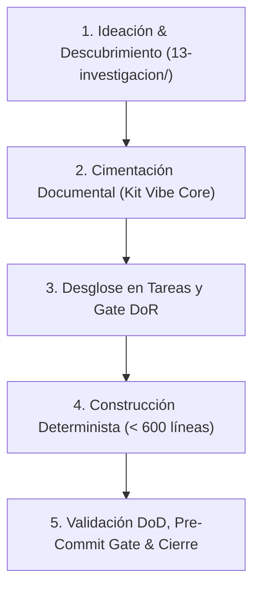

# Flujo de Ejecución — Vibe System

> **Estado:** ACTIVO  
> **Tipo:** especificación de proceso operativo y ciclo de trabajo  
> **Fuente de verdad:** Sí, para el flujo de trabajo entre Luigi y los agentes de IA  
> **Responsable:** Luigi  
> **Clasificación:** INTERNA  
> **Versión:** 1.0.0  
> **Creado:** 2026-09-11  
> **Última actualización:** 2026-09-11  

---

## 0. Propósito

Este documento establece el mecanismo operativo exacto de cómo se ejecuta el trabajo en cualquier proyecto construido bajo Vibe System. Define tanto el **macroflujo** de vida del proyecto (de 0 a producción) como el **microflujo** de cada sesión individual de trabajo.

---

## 1. El Macroflujo: Ciclo Maestro de 5 Fases

Todo desarrollo sigue una secuencia unidireccional y rigurosa en 5 fases:

### Fase 1: Ideación & Descubrimiento
- **Objetivo:** Explorar la necesidad del cliente o usuario, evaluar viabilidad técnica y delimitar el problema.
- **Ubicación:** `13-investigacion/borradores/`.
- **Salida obligatoria:** Resumen de hechos confirmados e hipótesis registrado en `fuentes-principales/inteligencia.md`.

### Fase 2: Cimentación Documental
- **Objetivo:** Establecer las reglas del juego antes de escribir una sola línea de lógica de negocio.
- **Acciones:**
  - Instanciar la tríada de memoria (`agent.md`, `inteligencia.md`, `bitacora.md`).
  - Configurar las convenciones del proyecto en `00-control/convenciones.md`.
  - Redactar especificaciones de arquitectura en `03-arquitectura/`.
  - Registrar las decisiones técnicas fundamentales como ADRs en `02-decisiones/`.
- **Gate:** Luigi aprueba el diseño arquitectónico y los límites de seguridad.

### Fase 3: Desglose y Gate DoR (Definition of Ready)
- **Objetivo:** Dividir el trabajo en tareas atómicas (`T-xxx`) asignadas a un hito (`H[n]`).
- **Condición inquebrantable:** Ninguna tarea pasa al estado `EN_PROGRESO` si no cumple la totalidad de criterios de la [Definition of Ready](../00-control/definition-of-ready.md).
- **Parámetro:** Cada tarea debe poder ejecutarse y verificarse en un ciclo de 1 a 3 pasos atómicos.

### Fase 4: Construcción Determinista
- **Objetivo:** Implementación de código y pruebas por parte de la IA bajo supervisión de Luigi.
- **Reglas operativas:**
  - La IA lee primero las fuentes obligatorias antes de proponer código (`agent.md` sección 2).
  - Modificaciones quirúrgicas: solo se tocan las líneas estrictamente necesarias.
  - Ningún archivo debe superar ~600 líneas de longitud.
  - Se escriben pruebas unitarias o de integración automatizadas junto con la funcionalidad.

### Fase 5: Validación DoD (Definition of Done) & Cierre
- **Objetivo:** Aceptar formalmente la tarea o hito con evidencia verificable.
- **Acciones:**
  - Pasar el [Pre-Commit Gate Checklist](../00-control/pre-commit-gate-checklist.md).
  - Verificar todos los criterios de la [Definition of Done](../00-control/definition-of-done.md).
  - Responder a las 4 preguntas de control.
  - Asentar la entrada en `fuentes-principales/bitacora.md`.

---

## 2. El Microflujo: Protocolo de Sesión de Trabajo

Cada sesión de desarrollo sigue estrictamente estos 5 pasos ordenados:

### Paso 1: Apertura de Sesión
- La IA y Luigi leen la última entrada de `fuentes-principales/bitacora.md` para recuperar el hilo temporal.
- Se revisa `fuentes-principales/inteligencia.md` para confirmar hechos vigentes, decisiones activas y bloqueos abiertos.
- Se selecciona la tarea activa (`T-xxx`).

### Paso 2: Alineación y Verificación DoR
- Se confirma que la tarea tiene:
  - Título y objetivo conciso.
  - Requisitos asociados (`REQ-xxx`).
  - Criterios de aceptación comprobables ("Dado que... Cuando... Entonces...").
  - Pruebas requeridas identificadas.
  - Dependencias resueltas.

### Paso 3: Edición Quirúrgica y Ejecución
- Se implementa el cambio mínimo necesario.
- Si el archivo resultante se acerca a 600 líneas, se aplica descomposición modular inmediata.
- Si surge una discrepancia arquitectónica, se detiene la codificación y se redacta un ADR o RFC antes de continuar.

### Paso 4: Pre-Commit Gate
- Verificación automatizada:
  - ¿Compila sin errores ni advertencias de linting?
  - ¿Pasan todas las pruebas automatizadas?
  - ¿Hay cero secretos, API keys o tokens expuestos?
  - ¿Se mantiene la regla de 600 líneas?

### Paso 5: Cierre de Sesión y Asentamiento de Memoria
- Actualizar el estado de la tarea en `00-control/estados-del-trabajo.md` (o archivo de hito).
- Actualizar `fuentes-principales/inteligencia.md` si hubo un nuevo hecho, decisión o riesgo.
- Redactar la entrada en `fuentes-principales/bitacora.md` documentando: Hecho, Decisiones, Riesgos, Documentos editados, Evidencia y Siguiente paso.

---

## 3. Las 4 Preguntas de Control Obligatorias

Toda entrega o pull request generado por la IA debe responder explícitamente:

1. **¿Qué cambió?** (Archivos creados, modificados o eliminados).
2. **¿Por qué cambió?** (Tarea e ID de requisito al que responde el cambio).
3. **¿Cómo sabemos que no rompió nada?** (Pruebas ejecutadas, evidencia objetiva).
4. **¿Qué documento se actualizó?** (Bitácora, inteligencia, arquitectura o especificación correspondiente).
