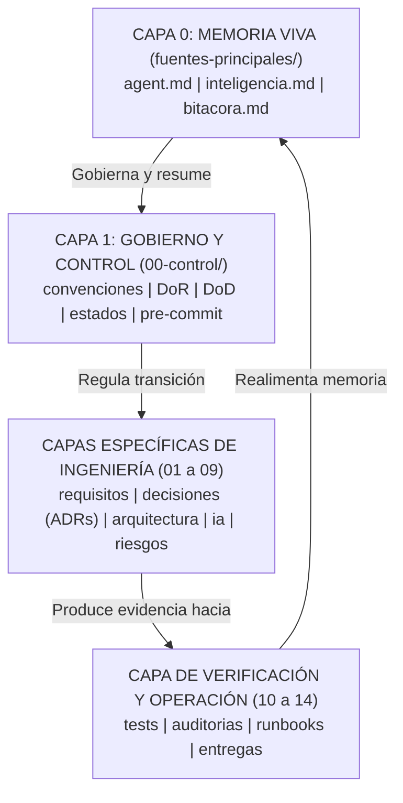

# Arquitectura Documental — Vibe System

> **Estado:** ACTIVO  
> **Tipo:** especificación arquitectónica del sistema de documentación  
> **Fuente de verdad:** Sí, para la organización y flujo de información entre documentos  
> **Responsable:** Luigi  
> **Clasificación:** INTERNA  
> **Versión:** 1.0.0  
> **Creado:** 2026-09-11  
> **Última actualización:** 2026-09-11  

---

## 0. Propósito

Este documento establece el **plano arquitectónico del sistema de documentación** de Vibe System. Modela cómo se relacionan las distintas capas documentales, cómo fluye la información entre ellas y cómo se previene la saturación de contexto en los modelos de lenguaje mediante una topología estricta de responsabilidades.

---

## 1. El Modelo en Capas de Vibe System

La documentación de Vibe System no es un conjunto desordenado de notas, sino una estructura multicapa con interfaces y contratos claros entre capas:



### Capa 0: Memoria Viva (`fuentes-principales/`)
Es la interfaz de entrada rápida para cualquier agente de IA o para Luigi. Su función es responder en segundos:
- ¿Cómo debe comportarse la IA? (`agent.md`).
- ¿Qué se está construyendo, qué está decidido y qué está bloqueado? (`inteligencia.md`).
- ¿Qué ocurrió en la última sesión y cuál es el siguiente paso? (`bitacora.md`).

### Capa 1: Gobierno y Control (`00-control/`)
Es el "sistema nervioso" del proyecto. Dicta las leyes invariantes:
- ¿Cuándo está lista una tarea para codificarse? (`definition-of-ready.md`).
- ¿Cuándo se acepta un trabajo como terminado? (`definition-of-done.md`).
- ¿Qué nombres, rutas e IDs son válidos? (`convenciones.md`).
- ¿Qué checklist debe cumplirse antes de guardar cambios? (`pre-commit-gate-checklist.md`).

### Capas 2 a 5: Ingeniería y Diseño del Dominio
- **01-requisitos:** El *qué* funcional desde la perspectiva del usuario o cliente.
- **02-decisiones:** Los ADRs que justifican el *por qué* de decisiones inmutables.
- **03-arquitectura:** El *cómo* técnico estructural (modelos de datos, APIs, topología).
- **04 a 09:** Dominios especializados (IA, seguridad, calidad, infraestructura, riesgos).

### Capa 6: Verificación y Resiliencia (`10-tests/`, `11-auditorias/`, `12-runbooks/`)
Es la capa de evidencia empírica:
- `10-tests/`: Pruebas reproducibles que respaldan que el código funciona.
- `11-auditorias/`: Revisiones formales de hitos y seguridad.
- `12-runbooks/`: Procedimientos operacionales para despliegue, rollback y recuperación ante fallos.

---

## 2. Principio de Aislamiento de Contexto

Para evitar que los LLMs consuman tokens innecesarios o alucinen por sobrecarga de información, Vibe System impone las siguientes reglas de navegación:

1. **Lectura quirúrgica:** Una IA **nunca** debe leer todas las carpetas a la vez. Debe consultar únicamente la fuente específica que necesita según la matriz de `agent.md` (sección 2).
2. **Propósito único por archivo:** Cada documento resuelve un único problema o describe un único componente.
3. **Referencias por ruta relativa/absoluta y links:** Los documentos no copian contenido de otros documentos; en su lugar, se enlazan mediante links Markdown.
4. **Límite de 600 líneas:** Si un archivo supera este umbral, se divide en submódulos coordinados por un índice maestro.

---

## 3. Flujo de Información y Sincronización

```
[ Requisito REQ-xxx ] ➔ [ ADR-xxx si es estructural ]
          │
          ▼
[ Tarea T-xxx en DoR ] ➔ [ Código + Test en 10-tests ]
          │
          ▼
[ Pre-commit gate ] ➔ [ Actualización de bitacora.md e inteligencia.md ]
```

- Cada cambio en el código fuente debe estar respaldado por un requisito y una tarea.
- Si durante la codificación se toma una decisión de diseño no contemplada, se detiene la codificación y se asienta el ADR correspondiente antes de continuar.
- Al cerrar el ciclo, la memoria viva (`bitacora.md` e `inteligencia.md`) se actualiza inmediatamente para que la próxima sesión comience con el estado 100% fresco.
