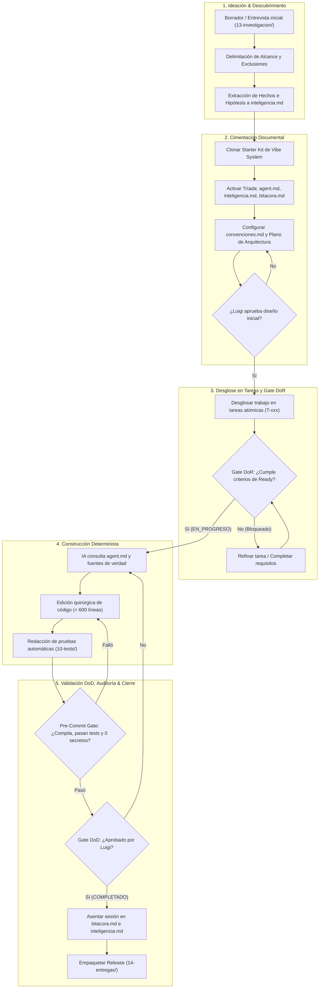
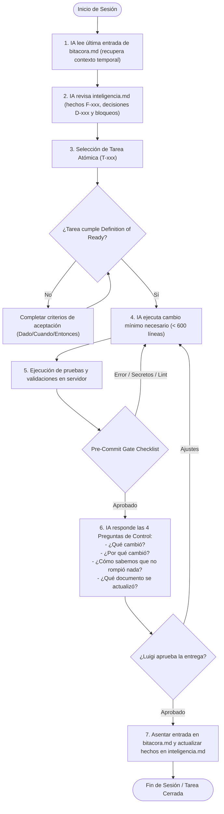
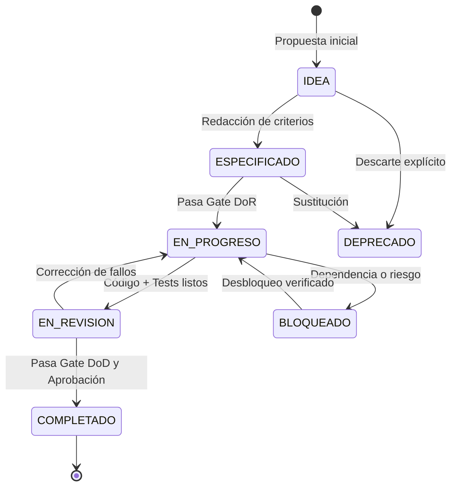

# Diagramas de Flujo del Sistema — Vibe System

> **Estado:** ACTIVO  
> **Tipo:** especificación visual y planos de flujo de procesos  
> **Fuente de verdad:** Sí, para la representación gráfica de flujos y ciclos  
> **Responsable:** Luigi  
> **Clasificación:** INTERNA  
> **Versión:** 1.0.0  
> **Creado:** 2026-09-11  
> **Última actualización:** 2026-09-11  

---

## 0. Propósito

Este documento reúne el **atlas visual oficial de Vibe System**, modelado íntegramente en Mermaid. Proporciona una referencia visual inmediata de cómo transitan los proyectos, cómo interactúa Luigi con los agentes de IA en el día a día y cómo fluye la memoria a través de las capas del sistema.

---

## 1. Diagrama de Macroflujo: Ciclo de Vida del Proyecto

Muestra la secuencia de maduración desde la concepción inicial de una idea hasta la entrega y empaquetado del software:

---

## 2. Diagrama de Microflujo: Protocolo de Sesión Diaria (Luigi ↔ IA)

Modela el protocolo de ejecución quirúrgica que la IA aplica en cada turno de trabajo para evitar alucinaciones y amnesia:

---

## 3. Diagrama de Flujo de Información entre Carpetas

Ilustra la circulación de contratos y evidencia para preservar la ventana de tokens:

```mermaid
flowchart LR
    subgraph MEMORIA["Capa 0: Memoria Viva (fuentes-principales/)"]
        direction TB
        AG["agent.md
(Reglas de engagement y límites IA)"]
        INT["inteligencia.md
(Contexto curado, hechos, decisiones)"]
        BIT["bitacora.md
(Diario cronológico de sesiones)"]
    end

    subgraph CONTROL["Capa 1: Control (00-control/)"]
        direction TB
        DOR["definition-of-ready.md"]
        DOD["definition-of-done.md"]
        GATE["pre-commit-gate-checklist.md"]
        EST["estados-del-trabajo.md"]
    end

    subgraph INGENIERIA["Capas Técnicas (01 a 09)"]
        direction TB
        REQ["01-requisitos/
(Visión y casos de uso)"]
        ADR["02-decisiones/
(ADRs inmutables)"]
        ARQ["03-arquitectura/
(Planos técnicos)"]
        RSK["09-riesgos/
(Matriz de mitigación)"]
    end

    subgraph VERIFICACION["Capa de Evidencia (10 a 14)"]
        direction TB
        TST["10-tests/
(Suites reproducibles)"]
        AUD["11-auditorias/
(Certificación formal)"]
        REL["14-entregas/
(Release Notes)"]
    end

    MEMORIA <--> CONTROL
    CONTROL --> INGENIERIA
    INGENIERIA --> VERIFICACION
    VERIFICACION --> MEMORIA
```

---

## 4. Diagrama de Transición de Estados del Trabajo

Representa la máquina de estados formal normada en PAR-04:

